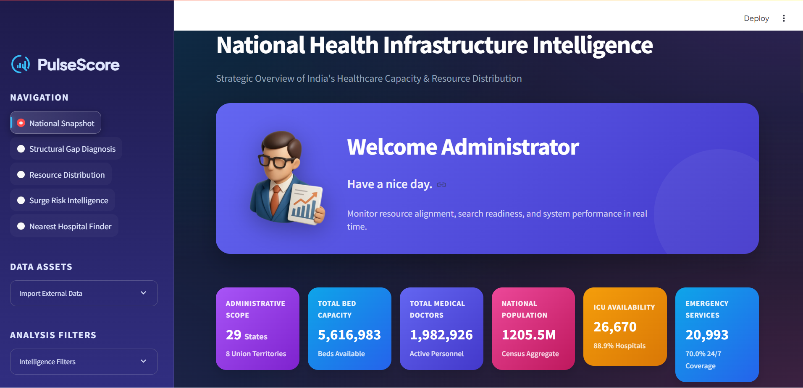
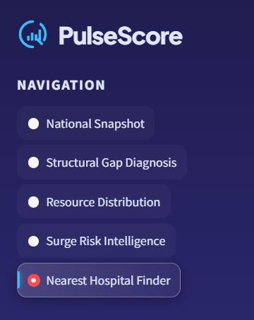
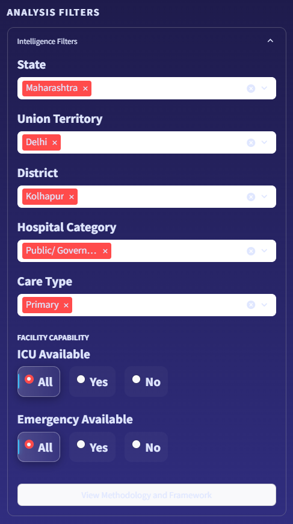
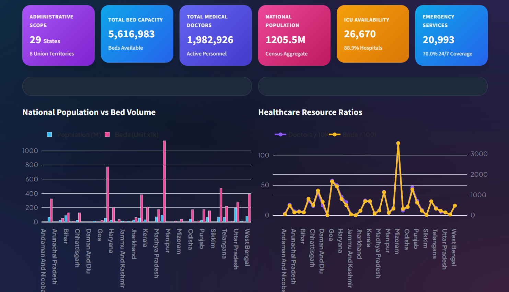
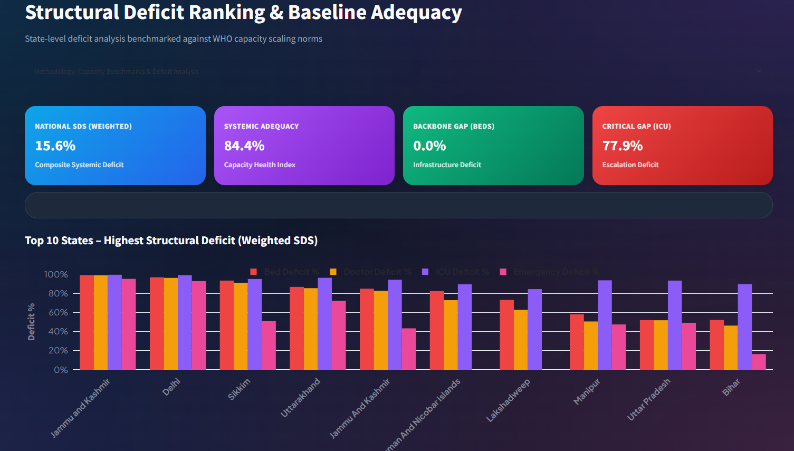
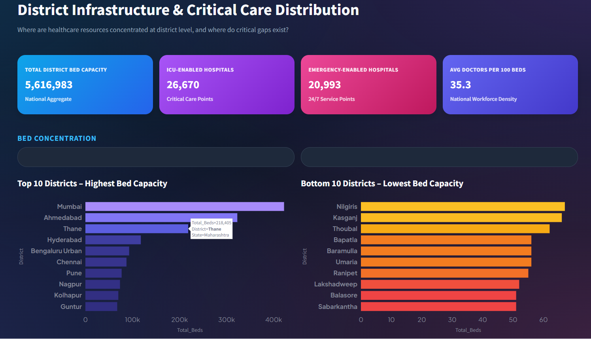
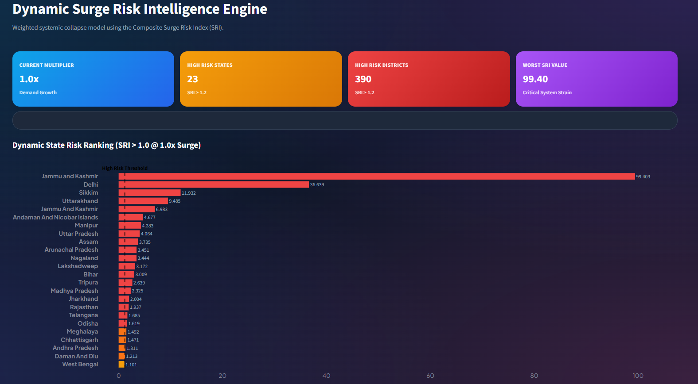
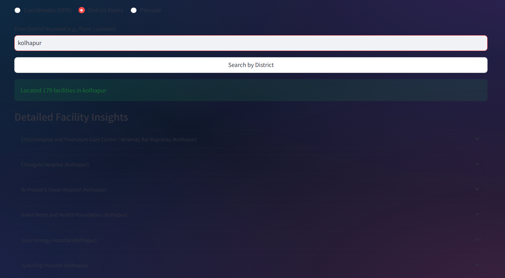

# Infosys Springboard Internship Project

# PulseScore Healthcare Operation Dashboard

A production-grade healthcare analytics platform for monitoring India's healthcare infrastructure capacity, resource distribution, and surge readiness using WHO-benchmarked standards.


## Screenshots

### Dashboard


### Navigation


### Analysis Filter


### National Snapshot Dashboard

*Executive KPI cards, population vs bed capacity, and interactive choropleth map*

### Structural Gap Diagnosis

*WHO-benchmarked deficit analysis with weighted SDS scoring*

### Resource Distribution Analysis

*District-level bed, ICU, and emergency facility distribution*

### Surge Risk Intelligence

*Dynamic surge modeling with adjustable multipliers and risk rankings*

### Hospital Finder

*GPS-based search with radius filtering and detailed facility cards*

## Features

### 1. National Snapshot
- Executive KPI dashboard (beds, doctors, population, ICU/emergency coverage)
- Population vs bed capacity visualization
- Healthcare resource ratios (doctors/10K, beds/100K)
- Interactive choropleth map with population density
- Regional capacity rankings

### 2. Structural Gap Diagnosis
- WHO-benchmarked capacity requirements
- Weighted Structural Deficit Score (SDS):
  - 40% Bed Deficit
  - 30% Doctor Deficit  
  - 20% ICU Deficit
  - 10% Emergency Deficit
- Top 10 deficient vs strong states comparison

### 3. Resource Distribution
- District-level bed/ICU/emergency facility analysis
- Doctor-to-bed ratio analysis
- Care hierarchy distribution (Primary/Secondary/Tertiary)

### 4. Surge Risk Intelligence
- Dynamic Surge Risk Index (SRI) calculation
- Adjustable surge multiplier (1.0x - 3.0x demand)
- Elasticity factor (system stretch capacity)
- State & district-level risk rankings
- Downloadable surge requirement matrices

### 5. Hospital Finder
- GPS coordinate-based search (radius-based)
- District name search
- Pincode search

## Installation

```bash
# Clone repository
git clone <repository-url>
cd "Healthcare Operation Dashboard"

# Install dependencies
pip install -r requirements.txt
```

## Usage

```bash
streamlit run app.py
```

Access the dashboard at `http://localhost:8501`

## Project Structure

```
Healthcare Operation Dashboard/
├── app.py                          # Main application
├── requirements.txt                # Dependencies
├── logic/
│   └── core.py                    # Data processing utilities
├── sections/
│   ├── snapshot.py                # National overview
│   ├── structural_gaps.py         # Deficit analysis
│   ├── resource_distribution.py   # District resources
│   ├── surge_intelligence.py      # Surge modeling
│   └── hospital_finder.py         # Location search
├── dataset/
│   └── India_Healthcare_Final_GeoPreserved.csv
├── geojson/
│   ├── india_state.geojson
│   └── india_district.geojson
└── avatar/
    └── download.png
```

## Methodology

### WHO Capacity Benchmarks
- **Required Beds** = `(Population × 3) / 1,000`
- **Required Doctors** = `(Population × 1) / 1,000`
- **Required ICU** = `(Population × 10) / 100,000`
- **Required Emergency** = `(Population × 1) / 100,000`

### Surge Risk Index (SRI)
```
SRI = 0.4 × Stress_Beds + 0.3 × Stress_Docs + 0.2 × Stress_ICU + 0.1 × Stress_ER

Where: Stress_X = (Required_X × Surge_Multiplier) / (Available_X × Elasticity)
```

**Risk Classification:**
- `< 1.0`: Stable
- `1.0 - 1.2`: Saturated
- `1.2 - 1.5`: High Risk
- `> 1.5`: Critical

## Tech Stack

- **Frontend**: Streamlit
- **Visualization**: Plotly
- **Data Processing**: Pandas, NumPy
- **Geospatial**: Geopy
- **Reporting**: FPDF2, Kaleido

## Features

- ✅ Interactive filtering (state/district/category/ICU/emergency)
- ✅ Dark/Light mode toggle
- ✅ PDF report generation
- ✅ CSV data export
- ✅ Real-time surge modeling
- ✅ GPS-based hospital search

## Configuration

### Custom Data Upload
Upload your own healthcare dataset via the sidebar. Required columns:
- `State`, `District`, `Hospital_Name`, `Total_Num_Beds`, `Number_Doctor`
- `Location_Coordinates`, `Facilities`, `Emergency_Services`
- `Hospital_Category`, `Hospital_Care_Type`, `State_Population`

## Contributing

1. Fork the repository
2. Create feature branch (`git checkout -b feature/enhancement`)
3. Commit changes (`git commit -m 'Add enhancement'`)
4. Push to branch (`git push origin feature/enhancement`)
5. Open Pull Request

## License

MIT License - see LICENSE file for details

## Internship Details

**Program**: Infosys Springboard Internship  
**Project Type**: Healthcare Analytics & Data Visualization  
**Domain**: Healthcare Infrastructure Management  
**Technologies**: Python, Streamlit, Plotly, Pandas, NumPy, Geopy

## Key Achievements

- ✅ Developed comprehensive healthcare analytics platform with 5 major modules
- ✅ Implemented WHO-benchmarked capacity assessment framework
- ✅ Created dynamic surge risk modeling system with real-time calculations
- ✅ Built interactive geospatial visualizations for 36 states/UTs and 700+ districts
- ✅ Integrated GPS-based hospital finder with radius search capabilities
- ✅ Designed professional UI with dark/light mode and responsive layouts
- ✅ Implemented PDF report generation and CSV export functionality

## Learning Outcomes

- Advanced data visualization techniques using Plotly
- Healthcare domain knowledge and WHO standards
- Geospatial data processing and mapping
- Interactive dashboard development with Streamlit
- Mathematical modeling for risk assessment
- Production-grade code architecture and modular design

## Contact

For questions or support, please open an issue in the repository.

---

**Version**: 2.8 Enterprise Command Center  
**Internship**: Infosys Springboard  
**Last Updated**: 2026
